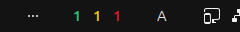
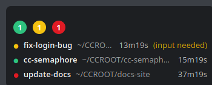

# cc-semaphore

A monitor for people running several [Claude Code](https://claude.com/claude-code)
sessions at once. It shows, at a glance, which of your sessions are
**running**, **waiting** for input, or sitting **idle** after finishing —
so you know which one actually needs your attention.

Unlike tools built around cost tracking or a full transcript/log viewer,
cc-semaphore answers exactly one question — *is anything waiting on me?*
— and puts the answer in your OS status bar or system tray, not a
terminal or browser tab you have to keep open and switch back to.

Supported platforms: native Linux (Ubuntu), or Windows 10/11 — **but on
Windows, WSL is required**: `cc-semaphored` (the daemon that actually
watches your sessions) is a Linux binary with no native Windows build, so
it always runs inside WSL. `cc-semaphore-desktop` (the Windows tray icon
and panel) is only a frontend — it reads the snapshot WSL bridges over to
the Windows side, it doesn't watch sessions itself.

## Setup patterns

Three concrete setups, each with its own instructions below:

| Setup | Daemon runs in | Frontend |
|---|---|---|
| Native Linux | the same machine (inotify) | GNOME Shell extension |
| Windows 10/11 + WSL1 | WSL1 (polling) | `cc-semaphore-desktop` on Windows |
| Windows 10/11 + WSL2 | WSL2 (polling) | `cc-semaphore-desktop` on Windows |

WSL1 and WSL2 are set up identically here: this project doesn't currently
tell them apart (see `is_wsl()` in `crates/cc-semaphore-daemon/src/env.rs`)
and always treats either one like WSL1 — same polling-based daemon, same
`install-wsl1-autostart` command. That's a deliberate, conservative
default rather than a verified WSL2 optimization (inotify might well work
inside WSL2 too, but that hasn't been tested on real hardware), so don't
read "WSL2" in this doc as a distinct, better-supported path — it's the
same instructions as WSL1 throughout.

## Screenshots

GNOME Shell top bar (running / waiting / idle counts). The count that
changed most recently blinks for about 30 seconds to catch your eye —
here it's `waiting`, the one that actually needs you:


Static view of the same top bar:



The always-on-top panel (Windows), collapsed and expanded:




## Status model

| State | Meaning | Color |
|---|---|---|
| `running` | Actively working | Green |
| `waiting` | Waiting on input/approval (needs you) | Yellow |
| `idle` | Finished, sitting untouched (not urgent) | Red |

## Downloads

Prebuilt binaries for every tagged version are attached to the
[GitHub Releases](https://github.com/patakuti/cc-semaphore/releases) page:

- **Linux / WSL**: `cc-semaphored-linux-x86_64` — a static binary, no
  Rust toolchain needed, works unmodified on native Ubuntu, WSL1, and WSL2.
- **Windows**: either `cc-semaphore-desktop.exe` (just copy and run) or
  the NSIS installer (`cc-semaphore-desktop_*_x64-setup.exe`), which also
  registers the app to start on login.

No release yet, or want the latest unreleased build? Every pull request
also produces the same binaries as workflow artifacts
(`.github/workflows/linux-build.yml` / `windows-build.yml`).

## Getting started

### 1. Install the daemon (`cc-semaphored`)

`cc-semaphored` watches your Claude Code sessions and publishes a snapshot
that the frontends read. It writes to
`$XDG_RUNTIME_DIR/cc-semaphore/state.json` (falling back to
`~/.cache/cc-semaphore/state.json`); the JSON format itself is documented
in `docs/protocol.md`. **On Windows, run this inside WSL** — there is no
native Windows build of the daemon.

That directory is created (and re-chmodded on every write) as `0700`, so
other local users on the same Linux/WSL machine can't read your session
snapshot — the missing directory search permission blocks them regardless
of the file's own mode.

Download `cc-semaphored-linux-x86_64` from
[Releases](https://github.com/patakuti/cc-semaphore/releases) (see
[Downloads](#downloads) above) — no Rust toolchain required, and the same
binary works everywhere it's needed here (native Linux, WSL1, WSL2).
**Recommended install location: `~/.local/bin/cc-semaphored`** (the WSL
autostart hook below embeds whatever path you run it from, so moving the
binary later breaks autostart):

```sh
mkdir -p ~/.local/bin
mv cc-semaphored-linux-x86_64 ~/.local/bin/cc-semaphored
chmod +x ~/.local/bin/cc-semaphored
```

```sh
cc-semaphored once   # scan once, print the snapshot JSON to stdout
cc-semaphored watch  # live view in the terminal (redraws every second)
cc-semaphored daemon # run as a background daemon
```

Keeping it running differs by platform:

- **Native Linux**: `cc-semaphored install-service` writes a systemd user
  unit that starts automatically after login:

  ```sh
  cc-semaphored install-service
  systemctl --user daemon-reload
  systemctl --user enable --now cc-semaphore.service
  ```

- **WSL1 or WSL2**: this project doesn't currently tell WSL1 and WSL2
  apart — see [Setup patterns](#setup-patterns) above — so instead
  `cc-semaphored install-wsl1-autostart` adds a hook to `~/.bashrc`: every
  new shell tries to start the daemon, and does nothing if one is already
  running (enforced by a lock file):

  ```sh
  cc-semaphored install-wsl1-autostart
  ```

  If you'd rather not have a tool edit your shell rc file automatically,
  add `--print` instead — it leaves the file untouched and just prints
  the block for you to paste in yourself (into `.zshrc`, etc.):

  ```sh
  cc-semaphored install-wsl1-autostart --print
  ```

### 2. Pick a frontend

- **Native Linux**: the [GNOME Shell extension](#gnome-shell-extension-native-linux) below.
- **Windows (WSL1 or WSL2)**: [`cc-semaphore-desktop`](#windows-wsl1-or-wsl2-tray-icon-and-panel)
  below — a system tray icon plus an optional always-on-top panel, running
  natively on Windows (not inside WSL) and reading the snapshot WSL
  bridges over.

## GNOME Shell extension (native Linux)

```sh
ln -sfn "$(pwd)/extensions/cc-semaphore@patakuti" \
  ~/.local/share/gnome-shell/extensions/cc-semaphore@patakuti
# Restart GNOME Shell (X11: Alt+F2 → r → Enter. On Wayland, log out and back in)
gnome-extensions enable cc-semaphore@patakuti
```

The top bar shows the three counts (green/yellow/red). Click it to open a
popup with the full session list, sorted so the most recently changed
session is at the top. If the daemon isn't running (no heartbeat for 15+
seconds), the counts are replaced by a single `⚠` and the popup says so
too.

## Windows (WSL1 or WSL2): tray icon and panel

Requires the daemon (`cc-semaphored`) already installed and running
inside WSL — see [Install the daemon](#1-install-the-daemon-cc-semaphored)
above. `cc-semaphore-desktop` itself is a normal Windows app; it does not
run inside WSL.

Easiest path: install via the NSIS installer or just run the `.exe` from
[Releases](https://github.com/patakuti/cc-semaphore/releases) (see
[Downloads](#downloads) above) — either way, running it registers it to
start on login automatically (no opt-out toggle; there's no separate
"install" step beyond running it once).

The `.exe` and installer aren't code-signed, so Windows SmartScreen will
show an "unknown publisher" warning the first time you run either one —
click **More info → Run anyway**. This is expected for an unsigned
binary, not a sign that something's wrong; getting a code-signing
certificate is out of scope for this project for now.

To run from source instead:

```sh
cc-semaphored daemon &                        # run the daemon separately
cargo run -p cc-semaphore-desktop             # tray icon only, panel hidden by default
cargo run -p cc-semaphore-desktop -- --panel  # also open the panel right away
```

Either mouse button on the tray icon opens the same menu (`Show panel` /
`Quit`). The panel itself starts collapsed, showing just the three counts
as solid badges; click it to expand into the full session list (sorted the
same way as the GNOME extension's popup — most recently changed on top).
The card's background defaults to 90% transparent; while expanded, `[` /
`]` step it in 5% increments, and your choice is remembered across
restarts. If the daemon isn't running, the tray icon turns into a gray `?`
and the panel shows `⚠ daemon not running`.

## Configuration

All of it is optional — cc-semaphore works out of the box with no config
file. To override the defaults, create
`~/.config/cc-semaphore/config.json` (`%APPDATA%\cc-semaphore\config.json`
on Windows):

| Key | Default | Meaning |
|---|---|---|
| `includeKinds` | `["interactive"]` | Which session kinds to show |
| `inotifyDebounceMs` | `150` | Debounce for Linux inotify events |
| `livenessTickSecs` | `5` | How often to re-check process liveness on Linux |
| `wsl1PollIntervalMs` | `1000` | Poll interval under WSL (the key name says WSL1, but it applies equally to WSL2 — see [Setup patterns](#setup-patterns)) |
| `windowsStateDir` | (auto-detected) | Explicit override for the WSL→Windows snapshot path |
| `windowsPollIntervalMs` | `500` | (`cc-semaphore-desktop` only) mtime poll interval across DrvFs |

Everything else (UI redraw rate, tray icon rotation/blink timing, the
GNOME extension's fallback poll) is a fixed internal constant and isn't
configurable.

## Building from source

```sh
cargo build
cargo test
```

- `crates/cc-semaphore-core` — shared library: session-file parsing,
  the running/waiting/idle mapping, liveness checks, snapshot generation
- `crates/cc-semaphore-daemon` — the `cc-semaphored` binary (inotify
  watcher, WSL poller, snapshot writer, CLI)
- `crates/cc-semaphore-desktop` — the Tauri v2 app: always-on-top panel
  and Windows system tray
- `extensions/cc-semaphore@patakuti/` — the GNOME Shell 46 extension
- `ui/` — static HTML/CSS/JS shared by every frontend except the GNOME
  extension (no build step; no npm/Node.js). Open `ui/demo.html` via
  `python3 -m http.server -d ui` for a standalone preview with sample data
- `docs/protocol.md` — the JSON snapshot format shared between the daemon
  and every frontend

No npm, no bundler: `ui/`'s plain ES modules are loaded directly as
Tauri's `frontendDist`.

## License

MIT — see [LICENSE](LICENSE).
